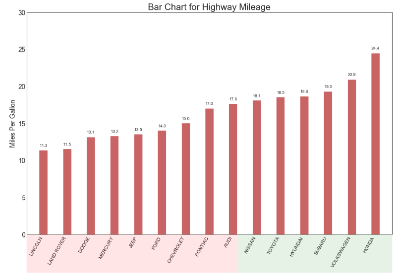

## 偏差 （Deviation）


### 有序条形图 （Ordered Bar Chart）

有序条形图有效地传达了项目的排名顺序。 但是，在图表上方添加度量标准的值，用户可以从图表本身获取精确信息。

### 导入所需要的库


```
import numpy as np              # 导入numpy库
import pandas as pd             # 导入pandas库
import matplotlib as mpl        # 导入matplotlib库
import matplotlib.pyplot as plt
import seaborn as sns           # 导入seaborn库
```
### 设定图像各种属性


```
large = 22; med = 16; small = 12

params = {'axes.titlesize': large,    # 设置子图上的标题字体
            'legend.fontsize': med,     # 设置图例的字体
            'figure.figsize': (16, 10), # 设置图像的画布
           'axes.labelsize': med,      # 设置标签的字体
            'xtick.labelsize': med,     # 设置x轴上的标尺的字体
            'ytick.labelsize': med,     # 设置整个画布的标题字体
          'figure.titlesize': large}  
plt.rcParams.update(params)           # 更新默认属性
plt.style.use('seaborn-whitegrid')    # 设定整体风格
sns.set_style("white")                # 设定整体背景风格
```
### 测试版本


```
print(mpl.__version__)
print(sns.__version__)
print(pd.__version__)
print(np.__version__)
```


### 程序代码

```
# step1:导入数据
df_raw = pd.read_csv("https://github.com/selva86/datasets/raw/master/mpg_ggplot2.csv")
df = df_raw[['cty', 'manufacturer']].groupby('manufacturer').apply(lambda x:x.mean())
df.sort_values('cty', inplace = True)
df.reset_index(inplace = True)

# step2:绘制有序条形图
    # 创建画布对象以及子图对象
fig,ax = plt.subplots(figsize = (16, 10),    # 画布尺寸
                     facecolor = 'white',    # 画布颜色
                     dpi = 80)               # 分辨率
    # 绘制柱状图
ax.vlines(x = df.index,                 # 横坐标
         ymin = 0,                      # 柱状图在y轴的起点
         ymax = df.cty,                 # 柱状图在y轴的终点
         color = 'firebrick',           # 柱状图的颜色
         alpha = 0.7,                   # 柱状图的透明度
         linewidth = 20)                # 柱状图的线宽

# step3：添加文本
    # enumerate() 函数用于将一个可遍历的数据对象(如列表、元组或字符串)组合为一个索引序列，同时列出数据和数据下标，
for i, cty, in enumerate(df.cty):       
    ax.text(i,                                  # 文本的横坐标位置
            cty+0.5,                            # 文本的纵坐标位置
            round(cty, 1),                      # 对文本中数据保留一位小数
            horizontalalignment = 'center')     # 相对于xy轴，水平对齐

# step4：装饰
ax.set_title('Bar Chart for Highway Mileage',   # 子图标题名称
            fontdict = {'size': 22})            # 标题字体尺寸
ax.set(ylabel = 'Miles Per Gallon',             # 纵坐标的标题名称
      ylim = (0,30))                            # 纵坐标的取值范围
    # 横坐标的刻度标尺
plt.xticks(df.index,                            # 横坐标的刻度位置
          df.manufacturer.str.upper(),          # 刻度标尺的内容（先转化为字符串，再转换为大写）
          rotation = 60,                        # 旋转角度
          horizontalalignment = 'right',        # 相对于刻度标尺右移
          fontsize = 12)                        # 字体尺寸

# step5：添加补丁
    # 添加绿色的补丁
p1 = patches.Rectangle((0.57, -0.005),                # 矩形左下角坐标 
                      width = 0.33,                   # 矩形的宽度
                      height = 0.13,                  # 矩形的高度
                      alpha = 0.1,                    # 矩阵的透明度
                      facecolor = 'green',            # 是否填充矩阵(设置为绿色)
                      transform = fig.transFigure)    # 保持矩形显示在图像最上方
    # 添加红色的补丁
p2 = patches.Rectangle((0.124, -0.005),               # 矩形左下角坐标
                      width = 0.446,                   # 矩形的宽度
                      height = 0.13,                  # 矩形的高度
                      alpha = 0.1,                    # 矩阵的透明度
                      facecolor = 'red',              # 是否填充矩阵(设置为红色)
                      transform = fig.transFigure)     # 保持矩形显示在图像最上方
    # 将补丁添加至画布
fig.add_artist(p1)    # 将p1添加至画布上
fig.add_artist(p2)    # 将p2添加至画布上
plt.show()            # 显示图像
```




