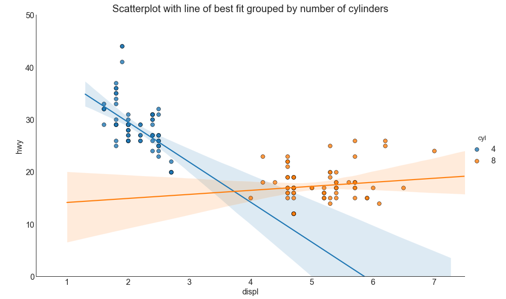
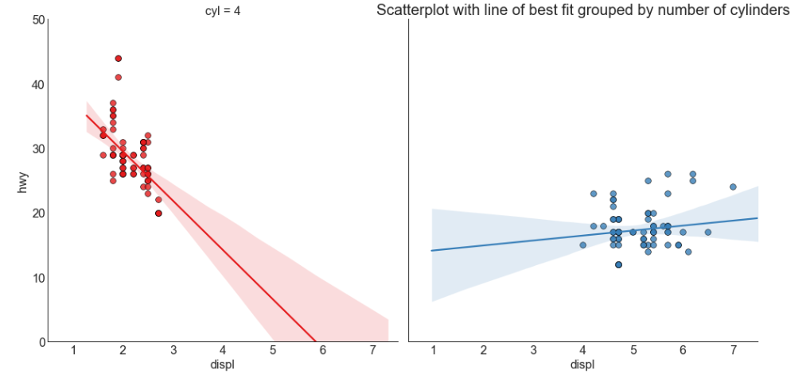

## 关联 （Correlation）


### 带线性回归最佳拟合线的散点图（Scatter plot with linear regression line of best fit） 


如果你想了解两个变量如何相互改变，那么最佳拟合线就是常用的方法。 下图显示了数据中各组之间最佳拟合线的差异。 要禁用分组并仅为整个数据集绘制一条最佳拟合线，请从下面的 sns.lmplot（）调用中删除 hue ='cyl'参数。


### 导入所需要的库

```
# 导入numpy库
import numpy as np
# 导入pandas库
import pandas as pd
# 导入matplotlib库
import matplotlib as mpl
import matplotlib.pyplot as plt
# 导入seaborn库
import seaborn as sns
# 在jupyter notebook显示图像
%matplotlib inline
```


### 设定图像各种属性

```
large = 22; med = 16; small = 12
            # 设置子图上的标题字体
params = {'axes.titlesize': large,  
            # 设置图例的字体
          'legend.fontsize': med,
            # 设置图像的画布
          'figure.figsize': (16, 10),  
            # 设置标签的字体
          'axes.labelsize': med, 
            # 设置x轴上的标尺的字体
          'xtick.labelsize': med,  
            # 设置整个画布的标题字体
          'ytick.labelsize': med,  
          'figure.titlesize': large}  
# 更新默认属性
plt.rcParams.update(params)  
 # 设定整体风格
plt.style.use('seaborn-whitegrid')
# 设定整体背景风格
sns.set_style("white")  
```

### 测试版本

```
print(mpl.__version__)
print(sns.__version__)
print(pd.__version__)
print(np.__version__)
```
### 程序代码


```
# step1:导入数据
df = pd.read_csv("https://raw.githubusercontent.com/selva86/datasets/master/mpg_ggplot2.csv")

    # 选择cyl为4,8的数据集
df_select = df.loc[df.cyl.isin([4, 8]), :]

# step2：绘图
    # 设立风格
sns.set_style('white')
                   
gridobj = sns.lmplot(x = 'displ',       # 横坐标
                   y = 'hwy',           # 纵坐标 
                    hue = 'cyl',        # 定义绘制数据的子集
                    data = df_select,   # 绘图所需要的数据集
                    height = 7,         # 每个子图的高度
                    aspect = 1.6,       # 每个子图的宽高比
                    robust = True,      # 抗噪声鲁棒性 
                    palette = 'tab10',  # 调色板（不同层次的“色调”变量）
                    # 设置其它参数
                    scatter_kws = dict(s = 60, linewidths = .7, edgecolors = 'black'))

# step3：装饰
    # 横纵坐标范围
gridobj.set(xlim = (0.5, 7.5), ylim = (0, 50))
    # 设置标题
plt.title("Scatterplot with line of best fit grouped by number of cylinders", fontsize=20)
    # 显示图像
plt.show()
```



```
# step1:导入数据
df = pd.read_csv("https://raw.githubusercontent.com/selva86/datasets/master/mpg_ggplot2.csv")

    # 选择cyl为4,8的数据集
df_select = df.loc[df.cyl.isin([4, 8]), :]

# step2：绘图
    # 设立风格
sns.set_style('white')
                   
gridobj = sns.lmplot(x = 'displ',       # 横坐标
                   y = 'hwy',           # 纵坐标 
                    hue = 'cyl',        # 定义绘制数据的子集
                    data = df_select,   # 绘图所需要的数据集
                    height = 7,         # 每个子图的高度
                    robust = True,      # 抗噪声鲁棒性
                    palette = 'Set1',  # 调色板（不同层次的“色调”变量）
                    col = 'cyl',        # 按照类别绘制图像，一个类别一张图像      
                    # 设置其它参数
                    scatter_kws = dict(s = 60, linewidths = .7, edgecolors = 'black'))

# step3：装饰
    # 横纵坐标范围
gridobj.set(xlim = (0.5, 7.5), ylim = (0, 50))
    # 设置标题
plt.title("Scatterplot with line of best fit grouped by number of cylinders", fontsize=20)
    # 显示图像
plt.show()
```




