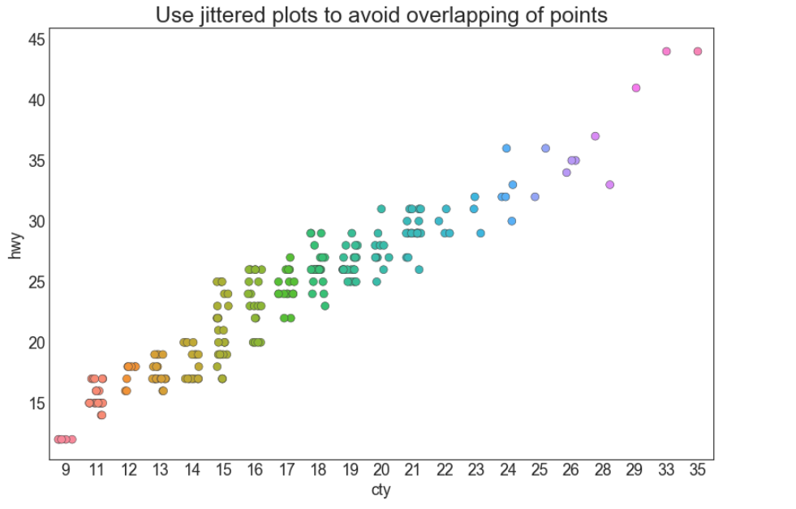

## 关联 （Correlation）

关联图表用于可视化2个或更多变量之间的关系。 也就是说，一个变量如何相对于另一个变化。

### 抖动图 （Jittering with stripplot）

通常，多个数据点具有完全相同的 X 和 Y 值。 结果，多个点绘制会重叠并隐藏。 为避免这种情况，请将数据点稍微抖动，以便您可以直观地看到它们。 使用 seaborn 的 stripplot（） 很方便实现这个功能。


### 导入所需要的库

```
# 导入numpy库
import numpy as np
# 导入pandas库
import pandas as pd
# 导入matplotlib库
import matplotlib as mpl
import matplotlib.pyplot as plt
# 导入seaborn库
import seaborn as sns
# 在jupyter notebook显示图像
%matplotlib inline
```
### 设定图像各种属性
```
large = 22; med = 16; small = 12
            # 设置子图上的标题字体
params = {'axes.titlesize': large,  
            # 设置图例的字体
          'legend.fontsize': med,
            # 设置图像的画布
          'figure.figsize': (16, 10),  
            # 设置标签的字体
          'axes.labelsize': med, 
            # 设置x轴上的标尺的字体
          'xtick.labelsize': med,  
            # 设置整个画布的标题字体
          'ytick.labelsize': med,  
          'figure.titlesize': large}  
# 更新默认属性
plt.rcParams.update(params)  
 # 设定整体风格
plt.style.use('seaborn-whitegrid')
# 设定整体背景风格
sns.set_style("white")  
```

### 测试版本


```
print(mpl.__version__)
print(sns.__version__)
print(pd.__version__)
print(np.__version__)
```
### 程序代码


```
# step1：导入数据 
df = pd.read_csv("https://raw.githubusercontent.com/selva86/datasets/master/mpg_ggplot2.csv")

# step2：绘画 Stripplot
    # 建立画布
fig, ax = plt.subplots(figsize = (12,8), dpi = 80)
    # 使用sns.stripplot绘画抖动图
             # x轴 
sns.stripplot(df.cty,
             # y轴 
             df.hwy,
             # 抖动的幅度
             jitter = 0.25,
             # 点的尺寸
             size = 8,
             # 子图，若有子图就获取当前的子图
             ax = ax,
             # 线宽
             linewidth = .5)

# step3:装饰
    # 显示标题
plt.title('Use jittered plots to avoid overlapping of points', fontsize=22)
    # 显示图像
plt.show()
```



