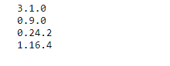
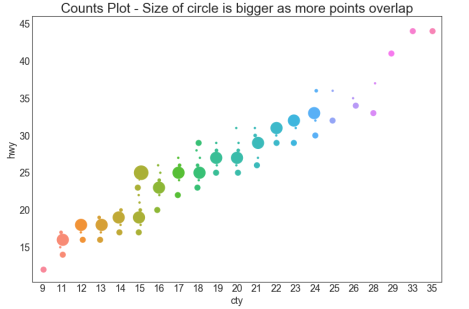

## 关联 （Correlation）

### 计数图 （Counts Plot）

避免点重叠问题的另一个选择是增加点的大小，这取决于该点中有多少点。 因此，点的大小越大，其周围的点的集中度越高。

### 导入所需要的库


```
# 导入库
import numpy as np
import pandas as pd
import matplotlib as mpl
import matplotlib.pyplot as plt
import seaborn as sns# 导入numpy库
import numpy as np
# 导入pandas库
import pandas as pd
# 导入matplotlib库
import matplotlib as mpl
import matplotlib.pyplot as plt
# 导入seaborn库
import seaborn as sns
# 在jupyter notebook显示图像
%matplotlib inline
```


### 设定图像各种属性

```
large = 22; med = 16; small = 12
            # 设置子图上的标题字体
params = {'axes.titlesize': large,  
            # 设置图例的字体
          'legend.fontsize': med,
            # 设置图像的画布
          'figure.figsize': (16, 10),  
            # 设置标签的字体
          'axes.labelsize': med, 
            # 设置x轴上的标尺的字体
          'xtick.labelsize': med,  
            # 设置整个画布的标题字体
          'ytick.labelsize': med,  
          'figure.titlesize': large}  
# 更新默认属性
plt.rcParams.update(params)  
 # 设定整体风格
plt.style.use('seaborn-whitegrid')
# 设定整体背景风格
sns.set_style("white")  
```

### 测试版本


```
print(mpl.__version__)
print(sns.__version__)
print(pd.__version__)
print(np.__version__)
```



### 程序代码


```
# step1:导入数据
df = pd.read_csv("https://raw.githubusercontent.com/selva86/datasets/master/mpg_ggplot2.csv")
    # groupby__可对具有相同'hwy','cty'进行分组
    # size__返回元素的数量
    # reset_index__重新设置连续的行索引index
        # name_计数的列名
df_counts = df.groupby(['hwy', 'cty']).size().reset_index(name = 'counts')

# step2：绘画 Stripplot
    # 设置画布
fig, ax = plt.subplots(figsize = (12, 8), dpi = 80)
              # 横坐标
sns.stripplot(df_counts.cty,
              # 纵坐标
              df_counts.hwy,
              # 尺寸
              size = df_counts.counts * 2,
              # 子图
              ax = ax)
# step3:装饰
    # 添加标题
plt.title('Counts Plot - Size of circle is bigger as more points overlap', fontsize=22)
    # 显示图像
plt.show()
```



