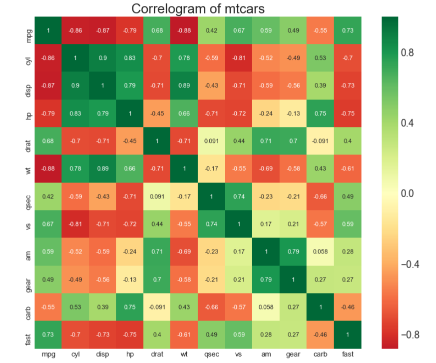

##  关联 （Correlation）

###   边缘箱形图 （Marginal Boxplot）
边缘箱图与边缘直方图具有相似的用途。 然而，箱线图有助于精确定位 X 和 Y 的中位数、第25和第75百分位数。


### 导入所需要的库

```

import numpy as np              # 导入numpy库
import pandas as pd             # 导入pandas库
import matplotlib as mpl        # 导入matplotlib库
import matplotlib.pyplot as plt
import seaborn as sns           # 导入seaborn库
%matplotlib inline              # 在jupyter notebook显示图像
```

### 设定图像各种属性


```
large = 22; med = 16; small = 12
            
params = {'axes.titlesize': large,    # 设置子图上的标题字体
            'legend.fontsize': med,     # 设置图例的字体
            'figure.figsize': (16, 10), # 设置图像的画布
           'axes.labelsize': med,      # 设置标签的字体
            'xtick.labelsize': med,     # 设置x轴上的标尺的字体
            'ytick.labelsize': med,     # 设置整个画布的标题字体
          'figure.titlesize': large}  
plt.rcParams.update(params)           # 更新默认属性
 plt.style.use('seaborn-whitegrid')    # 设定整体风格
sns.set_style("white")                # 设定整体背景风格
```
### 测试版本


```
print(mpl.__version__)
print(sns.__version__)
print(pd.__version__)
print(np.__version__)
```


### 程序代码


```
# step1:导入数据
df = pd.read_csv("https://github.com/selva86/datasets/raw/master/mtcars.csv")

# 绘制热力图
    # 画布
plt.figure(figsize = (12, 10),    # 画布尺寸
          dpi = 80)               # 分辨率
    #热力图
sns.heatmap(df.corr(),                         # 相关性矩阵数据集
           xticklabels = df.corr().columns,    # 横轴标签
           yticklabels = df.corr().columns,    # 纵轴标签
           cmap = 'RdYlGn',                    # 色谱(调色板)
           center = 0,                         # 将数据设置为图例中的均值数据，即图例中心的数据值
           annot = True)                       # annot默认为False，当annot为True时，在heatmap中每个方格写入数据

# step3:图像装饰
    # 设置标题和字体
plt.title('Correlogram of mtcars'   # 设置标题
          , fontsize = 22)          # 设置标题的尺寸
plt.xticks(fontsize = 12)           # 设置横坐标标尺字体尺寸
plt.yticks(fontsize = 12)           # 设置横坐标标尺字体尺寸
plt.show()

```





