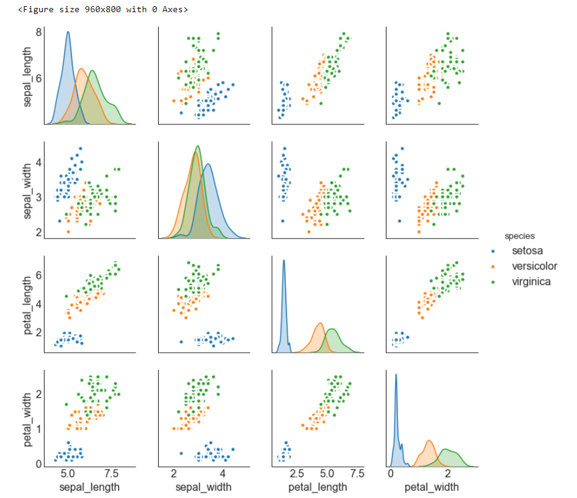
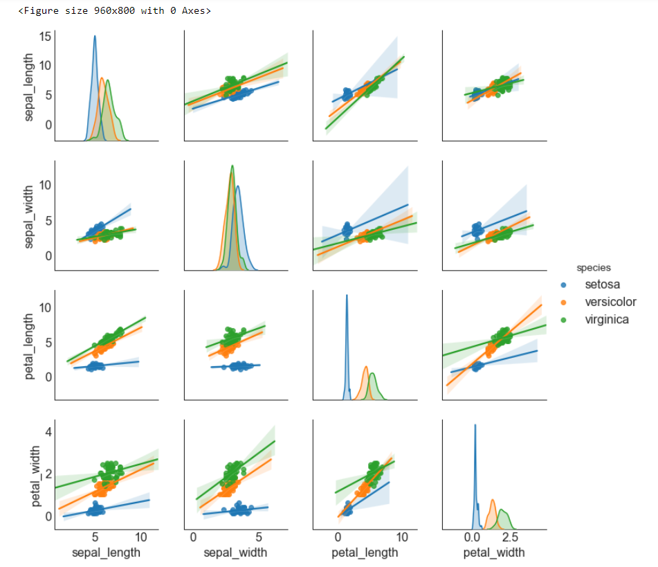

##  关联 （Correlation）

###   边缘箱形图 （Marginal Boxplot）
边缘箱图与边缘直方图具有相似的用途。 然而，箱线图有助于精确定位 X 和 Y 的中位数、第25和第75百分位数。


### 导入所需要的库

```

import numpy as np              # 导入numpy库
import pandas as pd             # 导入pandas库
import matplotlib as mpl        # 导入matplotlib库
import matplotlib.pyplot as plt
import seaborn as sns           # 导入seaborn库
%matplotlib inline              # 在jupyter notebook显示图像
```

### 设定图像各种属性


```
large = 22; med = 16; small = 12
            
params = {'axes.titlesize': large,    # 设置子图上的标题字体
            'legend.fontsize': med,     # 设置图例的字体
            'figure.figsize': (16, 10), # 设置图像的画布
           'axes.labelsize': med,      # 设置标签的字体
            'xtick.labelsize': med,     # 设置x轴上的标尺的字体
            'ytick.labelsize': med,     # 设置整个画布的标题字体
          'figure.titlesize': large}  
plt.rcParams.update(params)           # 更新默认属性
plt.style.use('seaborn-whitegrid')    # 设定整体风格
sns.set_style("white")                # 设定整体背景风格
```
### 测试版本


```
print(mpl.__version__)
print(sns.__version__)
print(pd.__version__)
print(np.__version__)
```


### 程序代码


```
# step1:导入数据
df = sns.load_dataset('iris')

# step2: 绘制矩阵图
    # 画布
plt.figure(figsize = (12, 10),    # 画布尺寸_(12, 10)
           dpi = 80)             # 分辨率_80
    # 矩阵图
sns.pairplot(df,                                     # 使用的数据
            kind = 'scatter',                        # 绘制图像的类型_scatter
            hue = 'species',                         # 类别的列，让不同类别具有不谈的颜色
            plot_kws = dict(s = 50,                  # 点的尺寸
                           edgecolor = 'white',      # 边缘颜色
                           linewidth = 2.5))         # 线宽
```





```
# step1:导入数据
df = sns.load_dataset('iris')

# step2: 绘制矩阵图
    # 画布
plt.figure(figsize = (12, 10),    # 画布尺寸_(12, 10)
           dpi = 80)             # 分辨率_80
    # 矩阵图(带有拟合线的散点图)
sns.pairplot(df,                                     # 使用的数据
            kind = 'reg',                            # 绘制图像的类型_reg
            hue = 'species')                         # 类别的列，让不同类别具有不谈的颜色
```



